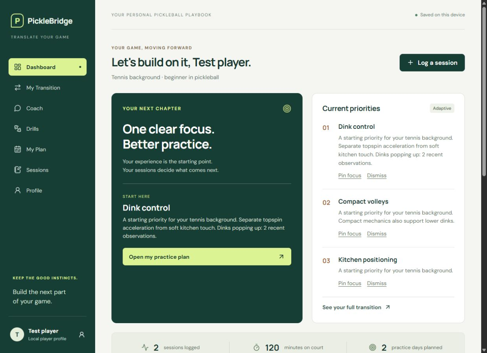
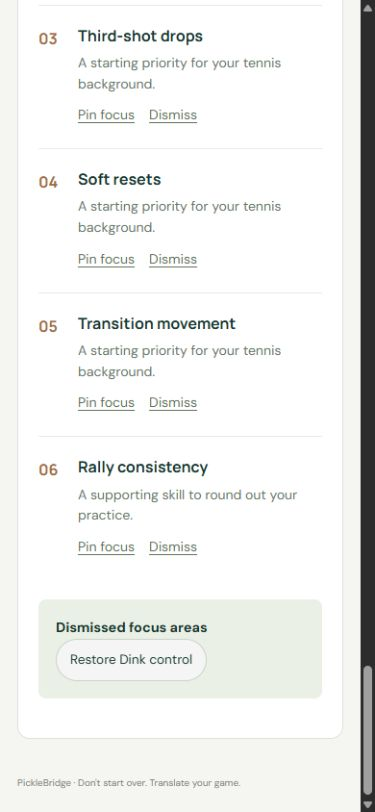

# PickleBridge

**Don't start over. Translate your game.**

PickleBridge is a local-first pickleball training application for players bringing experience from another racket sport. Tennis players often arrive with useful tracking, footwork and competitive instincts—and swing patterns or positioning habits that need adjustment. This app turns that starting point into an explainable practice path and updates it as players log actual sessions.

The coaching system is **deterministic**, built from authored content and transparent heuristics. It is not machine learning, an LLM, a technique diagnosis, or a scientifically validated skill assessment.

## Run locally

Use Node.js 22.12+ (Node 24 also supported) and npm. From this directory:

```bash
npm install
npm run dev
```

Open the local address printed by Vite, normally `http://127.0.0.1:5173`.

```bash
npm run typecheck
npm test
npm run build
npm run preview
```

`npm ci` is the reproducible CI/install path. Keep the supplied `package-lock.json`; it also avoids an npm 10 optional-peer resolution issue encountered when resolving the test runner without a lockfile. No API key, backend, account, database or environment variable is required. Development and preview bind to loopback by default.

## Features

- Three-step athletic assessment, including tennis format, style, backhand, net comfort, spin experience, goals and practice availability.
- Rich tennis transfer map and eight habit explanations, with usable badminton, table tennis, racquetball, other-racket and new-player pathways.
- Dashboard with actual logged session totals, current focus, issue observations, recommended drills and weekly plan.
- Session logging for date, duration, format, games/drills, positives, common/custom issues, notes and self-reported feeling.
- Observation/emerging/recurring issue detection and explainable adaptive priorities.
- Pin, dismiss and restore focus areas; resolve issue observations; inspect focus-change history.
- Fourteen drills spanning twelve skill categories, searchable and filterable by skill and group size. Each includes equipment, steps, targets, cues, mistakes, progression and a tennis connection.
- One-to-five-day practice plans with rotating drill selections and constrained play.
- Profile-aware coaching and tennis analogies across dinks, drops, drives, resets, volleys, serves, returns, positioning and movement.
- Versioned browser persistence, validation, explicit save errors, corrupted-data recovery/export, profile editing and confirmed reset.
- Accessible native controls, responsive layouts, visible focus styles and mobile navigation.
- Optional browser tools expose a read-only training summary and open the session form when WebMCP is supported. Normal operation never depends on it.

## Screenshots

Screenshots in `docs/screenshots/` show a **verification profile with explicitly labeled test sessions**, not actual athlete results or usage statistics.





To refresh: complete the assessment in a disposable browser profile, log two sessions with the same issue, open Dashboard, and capture desktop and 390px mobile views. Never commit a real player's private session export.

## Architecture

```text
src/
  types.ts                    Zod schemas and TypeScript domain types
  data/                       Authored sports, drills and coaching knowledge
  components/UI.tsx           Shared cards, headings, focus lists and drill detail
  features/                   Onboarding, dashboard, transition, coach, sessions,
                              training and profile screens
  lib/persistence.ts          PlayerRepository + localStorage implementation
  lib/playerService.ts        Validated domain mutations and agent tool boundary
  lib/recommendations.ts      Issue detection, scoring, drill ranking and plans
  lib/coaching.ts             CoachingEngine interface implementation
  lib/browserTools.ts         Optional browser agent affordances
  App.tsx                     Composition, navigation and committed UI state
tests/domain.test.ts          Behavioral tests of important domain boundaries
```

React + TypeScript + Vite, modern CSS, Lucide icons, Zod validation and Vitest. No large application framework or global-state dependency. Google Fonts is optional; system fonts are used if unavailable. The app does not send profiles or coaching messages to a server.

See [Architecture](docs/ARCHITECTURE.md), [Agent design](docs/AGENT-DESIGN.md), [Verification](docs/VERIFICATION.md) and [content notes](docs/CONTENT.md).

## How recommendations work

1. Start from sport-specific ordered skills. Tennis modifiers account for style, singles experience, net comfort, backhand and topspin; beginner fundamentals, advanced touch work and selected goals add weight.
2. Analyze the ten most recent sessions within the last thirty local calendar days. Count an issue at most once per session. One occurrence is an observation; two is emerging; three or more is recurring. Custom issue descriptions are trimmed, lowercased and whitespace-normalized.
3. Repeated issues add weight to the related skill. Dink pop-ups also add a smaller compact-mechanics weight. Every priority carries a plain-language explanation.
4. Pins take precedence; dismissed topics leave the active practice plan. At least one focus must remain active through the UI. Resolution suppresses observations through that calendar date; an occurrence on a later day starts a new count.
5. Rank drills from the current priorities. Plans use the requested day count, goal-specific play constraints and level-specific practice guidance. Regeneration rotates among suitable drills; it does not call an external generator.

The scores order practice suggestions only. They are deliberately not presented as percentages, improvement predictions or skill ratings.

## Limitations

- One player per browser origin. There is no cloud sync, login or cross-device recovery. Export is a JSON backup; in-app import is future work.
- Different hostnames/ports have different browser storage. Clearing site data removes the local profile.
- Coaching is topic matching plus structured content. It has no open-ended reasoning, cannot observe mechanics, and does not interpret prior chat turns as a conversational memory. Recent session history and player context are available separately.
- Chat never silently records a session or issue. Session submission and explicit application services own those writes.
- The rules are practical heuristics; training effectiveness has not been independently validated. Content should receive review from a qualified pickleball coach before a wider release.
- The plan is derived live from profile, date window and saved rotation counter. It is not a calendar, completed-work checklist or historical plan archive. Focus history records changes when the profile is saved, not daily background snapshots.
- Multiple tabs refresh after storage events, but simultaneous edits still use last-writer-wins semantics. This is not a multi-user system.
- Separate issue notes are deduplicated per issue/day; session entries are counted separately. A future agent must avoid recording the same observation via both channels.
- No video analysis, sensor data, authenticated LLM endpoint or automatic deployment is implemented.

## Highest-value next steps

1. Have a pickleball coach review the tennis pathway and test it with a few actual transitioning players.
2. Add session editing/deletion, validated backup import and persisted plan completion.
3. Add an authenticated backend implementing the repository contract for cross-device sync and concurrency control.
4. Introduce a server-only LLM adapter with explicit tool confirmation, schema validation and coaching evaluation cases.
5. Add optional self-reported confidence trends, courtside focus cards and accessible end-to-end CI tests.

GitHub Actions verifies types, tests and production builds on pushes and pull requests. Build output, dependencies, environment files and browser data are excluded from Git.
